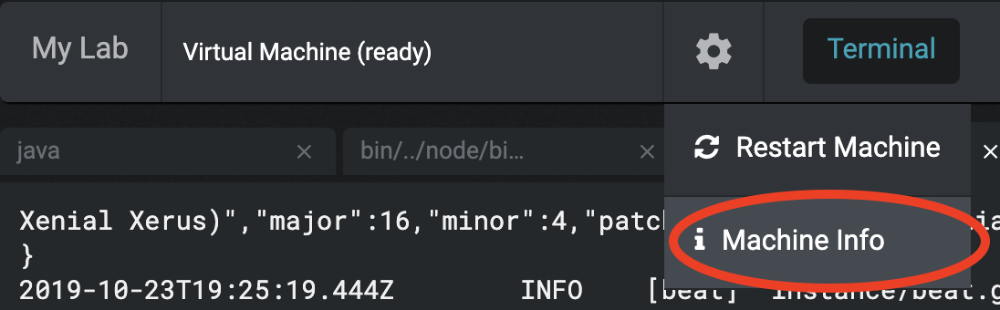
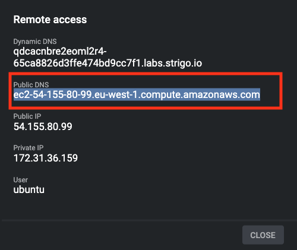
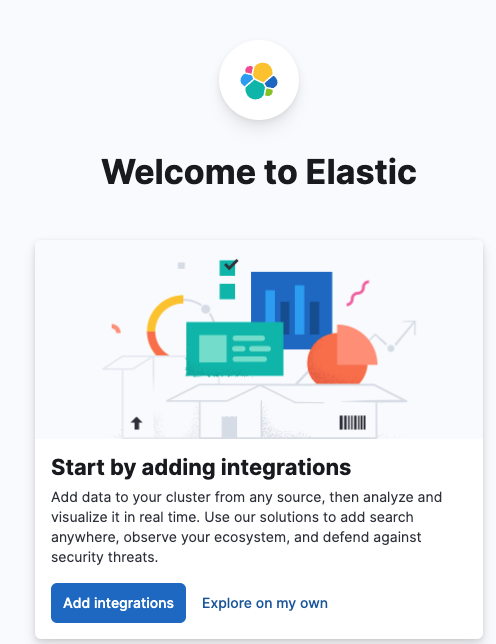
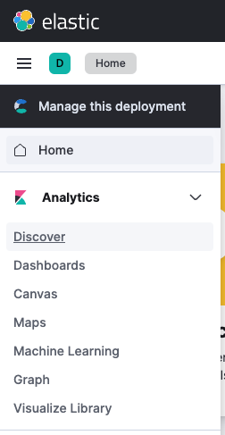
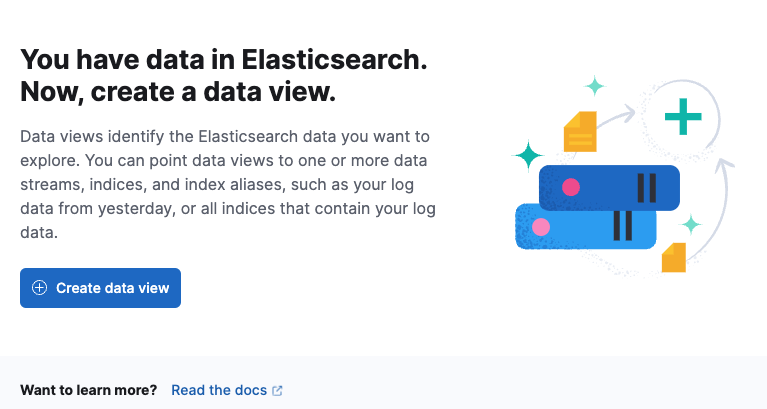
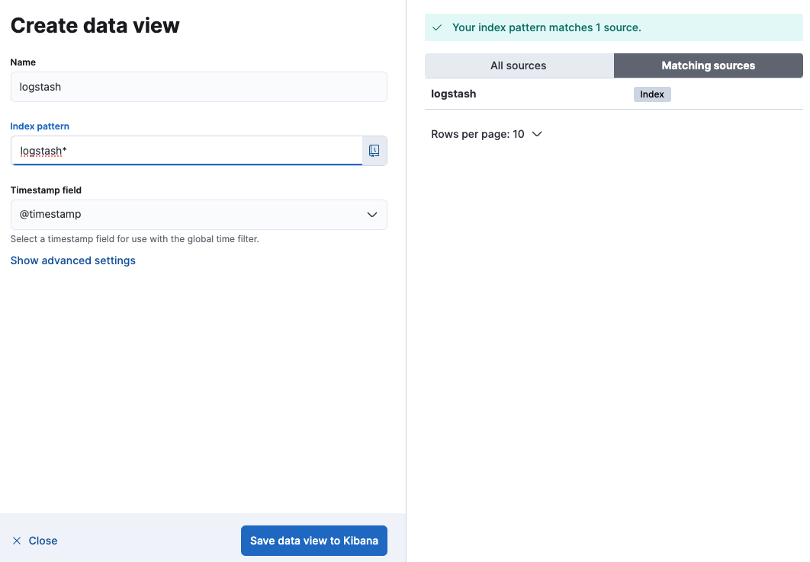
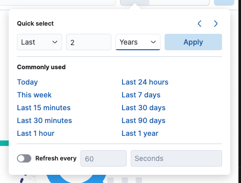

# Logstash Workshop

### Setup Environment

When the vm starts, you are automatically placed in your home directory.  You should have a file called `setup.sh`. Please run the file:

```
./setup.sh
```

### Logstash

To ingest Apache access log, please run 

```
elastic/logstash-8.12.1/bin/logstash -f /home/ubuntu/logstash-workshop/conf/logstash-nginx.conf
```

To ingest [OpenWeather.org](https://openweathermap.org/) data, please run

```
elastic/logstash-8.12.1/bin/logstash -f /home/ubuntu/logstash-workshop/conf/logstash_http_poller.conf
```

### Kibana

Let's launch into Kibana so we can visualize our data after it has been ingested via Logstash.

1. Go to Setting on the upper right corner and click on Machine Info.



2. Copy the Public DNS. 



3. Paste the DNS into a browser, add the port number for kibana `:5601` and hit enter. _For example_,

```
ec2-54-216-22-207.eu-west-1.compute.amazonaws.com:5601
```

4. When Kibana starts, please click on `Explore on my own`



5. Click on the 3 - on the upper left and select Discover



6. Click on Create Data View



7. Enter `logstash` as Name and `logstash*` as Index Pattern. The field @timestamp should appear in the Timestamp field.



8. Select the last 2 years to see the data. (The access log is from 2 years ago)


